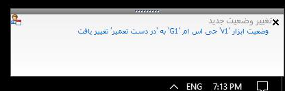

Notification Popup Window Nuget [](https://ci.appveyor.com/project/tulpep/notification-popup-window/branch/master)
========================
###A notification window that appears on the lower right part of the screen for .NET


It also supports the right to left languages like Persian and Arabic.
<br />



This project is based on a [Notification Window](http://www.codeproject.com/Articles/277584/Notification-Window) created in 2011 by Simon Baer. It is also base in [Office 2003-like popup notifier](http://www.codeproject.com/Articles/13547/An-Office-like-popup-notifier) created in 2006 by Nicolas Wälti.

###Features:
- Scroll and/or fade window in and out
- Configure the animation speed and the time the window is displayed
- Display a custom icon
- Set title and content text, font, size, and color
- Set all paddings around icon, title and content
- Sptionally display a close button
- Optionally display a button which opens a context menu

###How to use it
You can install the lastest version using [NuGet](https://www.nuget.org/packages/Tulpep.NotificationWindow/)
```powershell
Install-Package Tulpep.NotificationWindow
```

And use it this way:
```cs
var popupNotifier = new PopupNotifier();
popupNotifier.TitleText = "Title of popup";
popupNotifier.ContentText  = "Content text";
popupNotifier.Popup();

```
This repository contains a Visual Studio Test Project if you want a working example.
